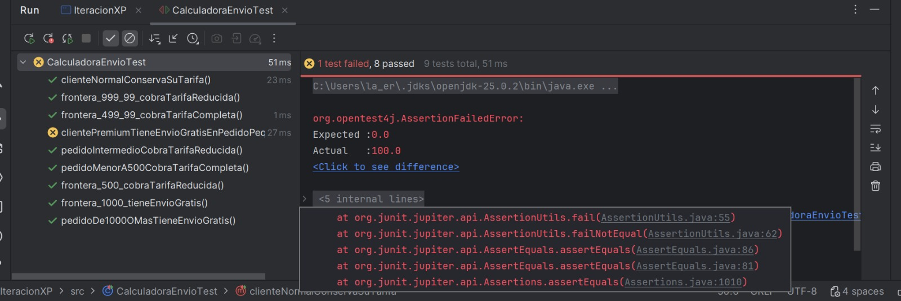
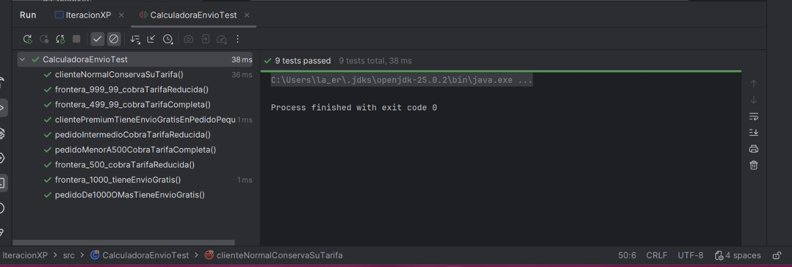

# Mini iteración XP — Cálculo de costo de envío

Práctica de un ciclo simplificado de Extreme Programming aplicando
User Story, Pair Programming, TDD, Simple Design y Refactoring.

*Materia:* Desarrollo de Sistemas III — Universidad de Sonora

## Integrantes

- Erandeni Mendivil Morales
- Adrián Alejandro Ojeda Morales

## Historia de usuario

> Como cliente de una tienda en línea,
> quiero conocer el costo de envío de mi pedido
> para conocer el monto total antes de comprar.

## Reglas de negocio

| Importe del pedido | Envío |
|---|---|
| Menos de $500 | $100 |
| $500 – $999.99 | $50 |
| $1,000 o más | Gratis |
| Cliente Premium | Gratis, sin importar el importe |

## Paso 1 — Definición de casos de prueba

Antes de escribir código definimos los casos que debía cumplir la función.

*Casos normales*

| Pedido | Envío esperado |
|---|---|
| $400.00 | $100 |
| $700.00 | $50 |
| $1,200.00 | $0 |

*Casos frontera*

| Pedido | Envío esperado | Razón |
|---|---|---|
| $499.99 | $100 | Todavía es "menos de $500" |
| $500.00 | $50 | El tramo medio inicia en $500 exacto |
| $999.99 | $50 | Último valor del tramo medio |
| $1,000.00 | $0 | "$1,000 o más" incluye el mil exacto |

Analizar las fronteras nos llevó a la decisión clave del diseño: las
comparaciones correctas son < 500 y < 1000. Si hubiéramos usado
<=, un pedido de $1,000 exactos habría pagado envío, contradiciendo
la regla del cliente.

## Paso 2 — Prueba en RED

Se escribieron las pruebas del nuevo requerimiento antes de tocar la
implementación. Como el método aún no contemplaba el caso Premium, la
prueba falla:

De 9 pruebas, 8 pasan y falla clientePremiumTieneEnvioGratisEnPedidoPequeno:
esperaba 0.0 y recibió 100.0.

## Paso 3 — Prueba en GREEN

Se escribió el código mínimo para satisfacer la prueba: una condición al
inicio del método. No se buscó una solución sofisticada.

Las 9 pruebas pasan. Las 7 originales **no requirieron modificación
alguna**.

## Paso 4 — Refactoring

Con las pruebas en verde se mejoró el código sin alterar su comportamiento:

- Se eliminaron los números mágicos (500, 1000, 100, 50).
- Se sustituyeron por constantes que expresan la regla de negocio:
  MINIMO_TARIFA_REDUCIDA, MINIMO_ENVIO_GRATIS, TARIFA_COMPLETA,
  TARIFA_REDUCIDA, ENVIO_GRATIS.
- Se separó la lógica de negocio (CalculadoraEnvio) de la presentación
  (IteracionXP), para que la función fuera testeable: retorna un valor
  en lugar de imprimirlo.

Después de cada cambio se volvieron a ejecutar las pruebas para
confirmar que seguían pasando.

## Paso 5 — Cambio del cliente

*Nuevo requerimiento:* los clientes Premium siempre tienen envío gratuito.

*¿Qué prueba nueva debemos escribir?*
Dos. La primera verifica que un cliente Premium con pedido de $100 no
paga envío. La segunda confirma que un cliente normal con ese mismo
importe sí paga los $100; sirve para asegurar que la nueva condición no
se aplique de más.

*¿Qué código debemos modificar?*
Se agregó esPremium como primera condición del método y una sobrecarga
calcular(importePedido) que delega en calcular(importePedido, false).

*¿Las pruebas anteriores continúan funcionando?*
Sí, las 7 pasaron sin modificar una sola línea. La sobrecarga permitió
que el código existente siguiera compilando y comportándose igual.

## Estructura del proyecto

src/CalculadoraEnvio.java       Lógica de negocio (testeable)
src/IteracionXP.java            Interfaz de consola
src/CalculadoraEnvioTest.java   9 pruebas unitarias (JUnit 5)
docs/                           Capturas de las corridas

## Cómo ejecutar las pruebas

Abrir el proyecto en IntelliJ IDEA, clic derecho sobre
CalculadoraEnvioTest → *Run 'CalculadoraEnvioTest'*.

## Reflexión

*¿Qué ventaja tuvo escribir primero los casos de prueba?*

Ayuda a validar los campos que sí queremos y los que no queremos para modificar el código.

*¿Qué aportó trabajar en pareja?*

Trabajar en pareja permitió revisar las decisiones durante el desarrollo. Además de dividir responsabilidades.

*¿Fue fácil incorporar el nuevo requerimiento?*

Sí, fue relativamente fácil porque el programa tenía una función específica encargada de calcular el costo de envío y ya contábamos con pruebas para comprobar el funcionamiento anterior. Aunque nos apoyamos para realizar los testing.

*¿Qué práctica de XP facilitó más el cambio?*

Escribir primero los casos de prueba ayudó a identificar claramente qué resultados debía devolver el programa en cada rango de compra y a considerar los valores frontera, como $500 y $1,000.